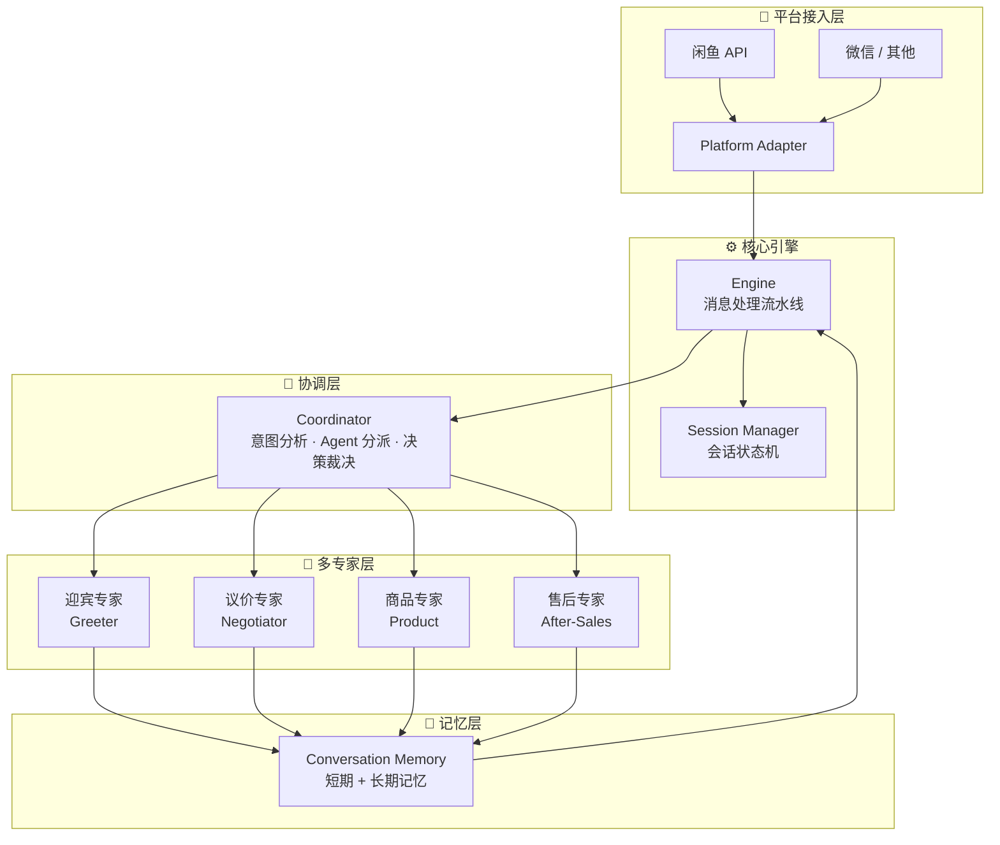

<div align="center">
  <br/>
  
</div>

<p align="center">
  <b>🏪 闲鱼平台 AI 值守解决方案</b><br/>
  <i>7×24 小时自动化 · 多专家协同决策 · 智能议价 · 上下文感知对话</i>
</p>

<p align="center">
  <a href="https://www.python.org/downloads/">
    
  </a>
  <a href="https://github.com/YunhaoDou/xianyu-ai-agent/blob/main/LICENSE">
    
  </a>
  <a href="https://github.com/YunhaoDou/xianyu-ai-agent/actions">
    
  </a>
  <a href="https://github.com/YunhaoDou/xianyu-ai-agent">
    
  </a>
  <a href="https://github.com/YunhaoDou/xianyu-ai-agent">
    
  </a>
  <a href="https://github.com/YunhaoDou/xianyu-ai-agent">
    
  </a>
  <a href="https://github.com/YunhaoDou/xianyu-ai-agent">
    
  </a>
  <a href="https://github.com/YunhaoDou/xianyu-ai-agent/issues">
    
  </a>
  <a href="https://github.com/psf/black">
    
  </a>
</p>

<br/>

---

## 🌟 为什么选择 xianyu-ai-agent？

> 在闲鱼上卖过东西的朋友都知道——**回复慢了，客户就跑了**。议价不知道怎么回，说少了亏、说多了客户不理。深夜想睡觉又怕错过订单…
>
> **xianyu-ai-agent 就是你的 24 小时金牌客服。** 4 位 AI 专家协同工作，从迎宾到议价到售后全部自动搞定。

<br/>

## 🎯 核心能力矩阵

<div align="center">

| 🤖 多专家协同 | 💰 智能议价 | 🧠 上下文感知 | 🔌 平台解耦 |
|:---:|:---:|:---:|:---:|
| 4 位 AI 专家分工协作 | 多轮价格博弈 | 全程记忆对话上下文 | 对接任意平台 |
| 协调器统一调度裁决 | 智能还价 + 自动成交 | 短期 + 长期买家画像 | 闲鱼 / 微信 / 淘宝 |
| 按意图自动分派 | 情感识别防差评 | 状态机自动流转 | 适配器模式设计 |

</div>

<br/>

## 🏗 系统架构



<br/>

## ⚡ 快速开始

### 📦 一分钟启动

```bash
# 克隆仓库
git clone https://github.com/YunhaoDou/xianyu-ai-agent.git
cd xianyu-ai-agent

# 创建虚拟环境
python -m venv .venv
source .venv/bin/activate  # macOS / Linux
# .venv\Scripts\activate   # Windows

# 一键安装
pip install -r requirements.txt

# 🎉 运行模拟对话（无需任何配置）
python -m src.main simulate --rounds 6 --price 200
```

### 🧪 看看效果

```
┌──────────────────────────────────────────────────────────────┐
│          🧪 模拟对话测试 · 商品标价: ¥200                     │
├──────────────────────────────────────────────────────────────┤
│                                                              │
│  🤖 AI → 你好！欢迎光临～😊                                   │
│  👤 ← 你好，这个相机还在吗？                                   │
│                                                              │
│  🤖 AI → 这件【精品二手相机】当前售价 ¥200.0，99新。          │
│  👤 ← 成色怎么样？快门次数多少？                               │
│                                                              │
│  🤖 AI → 亲放心，所有商品都是实物拍摄，保证正品～              │
│  👤 ← 150 能出不？ （🤖 检测到议价意图 → 转交议价专家）       │
│                                                              │
│  ── 议价开始 ──                                               │
│  👤 ← 150 能出不？                                            │
│  🤖 AI → 亲，这个品质在这放着呢，我给你按194，真的底价了😊     │
│                                                              │
│  👤 ← 还是贵了点，170吧                                       │
│  🤖 AI → 刚才还有别的买家在问，我给你做到186，最后一降了🙏    │
│                                                              │
│  👤 ← 180 行不行？这就拍                                      │
│  🤖 AI → 行吧，184，这真的是我底线了，再低宁愿自己留着🙏      │
│                                                              │
│  👤 ← 好的，就184，怎么下单？                                 │
│  🤖 AI → 痛快！请直接拍下，我马上改价～😊                     │
│                                                              │
└──────────────────────────────────────────────────────────────┘
```

**策略说明：** 卖家利益优先 — 三轮极小步让步（3%→5%→7%），坚守底价，绝不轻易放价。买家最终以 ¥184 成交，距标价仅差 8%。

<br/>

## 🧠 多 Agent 协同机制

```
买家发消息
    │
    ▼
┌─────────────────┐
│    Coordinator   │  ← 分析买家意图（关键词 + 正则）
│    (协调器)       │
└────────┬────────┘
         │ 并行调用所有 Agent 自评分 (can_handle)
         │
         ▼
┌──────┐ ┌──────┐ ┌──────┐ ┌──────┐
│迎宾  │ │议价  │ │商品  │ │售后  │
│0.2   │ │0.9   │ │0.3   │ │0.1   │  ← Agent 自评匹配度
└──────┘ └──────┘ └──────┘ └──────┘
         │
         │ 选 Top-2 → 获取详细回复 → 汇总裁决
         ▼
┌──────────────────────────────────┐
│  Coordinator 最终决策             │
│  ✓ 选置信度最高的回复             │
│  ✓ 处理状态转换（如 NEGOTIATING） │
│  ✓ 返回最终回复                  │
└──────────────────────────────────┘
```

### 🤖 四位 AI 专家分工

| 专家 | 角色 | 核心能力 | 触发场景 |
|------|------|----------|----------|
| **迎宾 (Greeter)** | 🤝 前台客服 | 问候、商品介绍、需求引导 | 新会话、寒暄 |
| **议价 (Negotiator)** | 💰 价格谈判官 | 出价提取、多轮议价、自动成交 | "便宜点"、"150卖不" |
| **商品 (Product)** | 📋 产品顾问 | FAQ、规格参数、物流售后解答 | "什么时候发货"、"尺寸" |
| **售后 (After-Sales)** | 🛡️ 纠纷调解员 | 退换货、投诉处理、自动升级 | "退货"、"差评"、"12315" |

<br/>

## 🔄 会话状态机

```
                    ┌──────────┐
                    │INITIATED │
                    └────┬─────┘
                         │
                    ┌────▼─────┐
               ┌───►│ GREETING │◄── 迎宾阶段
               │    └────┬─────┘
               │         │
               │    ┌────▼──────┐         ┌─────────┐
               │    │ INQUIRING │◄────────┤         │
               │    └────┬──────┘         │         │
               │         │                │         │
          ┌────▼────┐    │           ┌────▼─────┐   │
          │NEGOTIATE│◄───┴───────────┤  ORDER   │   │
          └────┬────┘                └────┬─────┘   │
               │                         │         │
               │                    ┌────▼──────┐  │
               │                    │COMPLETED  │──┘
               │                    └────┬──────┘
               │                         │
          ┌────▼──────┐           ┌──────▼─────┐
          │AFTER_SALES│◄──────────┤   CLOSED   │
          └────┬──────┘           └──────▲─────┘
               │                         │
          ┌────▼──────┐                  │
          │ ESCALATED ├──────────────────┘
          └───────────┘    (升级人工)
```

<br/>

## 📊 卖家利益议价引擎

议价是闲鱼最核心的场景。我们的引擎专为 **卖家利益最大化** 设计：

### 🛡️ 核心策略

| 策略 | 参数 | 说明 |
|------|:----:|------|
| **最低成交折扣** | 92% | 最多打 92 折，绝不贱卖 |
| **三轮让步法** | 3%→5%→7% | 极小步放价，逐步施压 |
| **还价立场** | 85% 偏向卖家 | 还价落在靠近标价一侧 |
| **恶意低报线** | 60% 以下直接拒 | < 标价 60% 不还价 |
| **自动成交阈值** | 97% 标价 | 出价到 97% 才自动接 |
| **议价疲劳上限** | 4 轮 | 4 轮不成交 → 僵局 |

### 🧠 决策树

```
买家出价 "150 卖不卖"
    │
    ▼
┌──────────────────────────────────────┐
│ Step 1: 出价提取 (Regex)              │
│   "¥150" / "150块" / "出150" / "150"  │
│   → 150.0                             │
└──────────────┬───────────────────────┘
               ▼
┌──────────────────────────────────────┐
│ Step 2: 风险分级                      │
├──────────────────────────────────────┤
│ 标价 ¥200  底价 ¥184 (92%)           │
│                                      │
│ 出价 150 (75%) → 低于底价            │
│ 出价 195 (97%) → 自动成交            │
│ 出价 220 (110%) → 秒接 超高溢价      │
│ 出价 80  (40%)  → ❌ 恶意低报 直接拒  │
└──────────────┬───────────────────────┘
               ▼
┌──────────────────────────────────────┐
│ Step 3: 三轮让步决策树                │
├──────────────────────────────────────┤
│                                      │
│ 出价 >= 标价   ──→ 🚀 超高溢价秒接    │
│                                      │
│ 出价 >= 97%    ──→ ✅ 自动成交       │
│                                      │
│ 出价 >= 底价   ──→ 三轮让步法         │
│  (≥184)        │  第1轮: 降3% 说服   │
│                │  第2轮: 降5% 稀缺性  │
│                │  第3轮: 降7% 底线   │
│                │  第4轮+: 咬死不动   │
│                                      │
│ 出价 < 底价    ──→ 先说服后松动       │
│  (<184)        │  第1-2轮: 品质说服   │
│                │  第3-4轮: 极小松动   │
│                │  第5轮+: 僵局       │
│                                      │
│ 出价 < 60%     ──→ ❌ 直接拒绝       │
│                                      │
└──────────────────────────────────────┘
```

### 🎯 三轮让步实战演示（标价 ¥200，买家出 ¥150）

```
第1轮  你: "这个品质在这放着呢，我给你按194，真的底价了"    ← 降3%
       👤: "还是贵了，170"
       
第2轮  你: "刚才还有别的买家在问，我给你做到186"            ← 降5% + 稀缺性
       👤: "180行不行？"
       
第3轮  你: "行吧，184，这真的是我底线了，再低宁愿自己留着"  ← 降7% + 底线声明
       👤: "好的就184"
       
结果: 🎉 以 ¥184 成交（仅降8%！挽回了买家74%的砍价空间）
```

### 💬 心理学话术库

| 话术类型 | 示例 | 效果 |
|---------|------|------|
| **价格锚定** | "原价¥350的东西，现在才¥200" | 提升感知价值 |
| **稀缺性施压** | "好几个买家都在问" | 制造紧迫感 |
| **品质说服** | "99新，跟新的没什么区别" | 合理化价格 |
| **底线声明** | "再低宁愿自己留着" | 封堵继续砍价 |
| **破例让步** | "你不要跟别人说这个价哈" | 营造获得感 |

<br/>

## 🗂️ 项目结构

```
xianyu-ai-agent/
├── src/
│   ├── main.py                    # 🚀 CLI 入口 & 应用启动
│   ├── core/
│   │   ├── engine.py              # ⚙️ 消息处理流水线
│   │   ├── message.py             # 📦 数据模型（Pydantic）
│   │   └── session.py             # 🔄 会话状态机
│   ├── agents/
│   │   ├── base.py                # 🧬 Agent 基类
│   │   ├── coordinator.py         # 🧠 协调器（Orchestrator）
│   │   ├── greeter.py             # 🤝 迎宾专家
│   │   ├── negotiator.py          # 💰 议价专家
│   │   ├── product_expert.py      # 📋 商品专家
│   │   └── after_sales.py         # 🛡️ 售后专家
│   ├── memory/
│   │   └── context.py             # 💾 上下文记忆管理
│   ├── platform/
│   │   ├── adapter.py             # 🔌 平台适配器抽象
│   │   └── xianyu.py              # 🐟 闲鱼 API 适配器
│   └── utils/
│       ├── logger.py              # 📝 日志配置
│       └── helpers.py             # 🔧 工具函数
├── config/
│   ├── config.yaml                # ⚙️ 主配置
│   └── prompts.yaml               # 📝 Prompt 模板
├── tests/                         # ✅ 44 个单元测试
├── docs/
│   └── architecture.md            # 📐 架构文档
└── .github/
    ├── workflows/
    │   └── ci.yml                 # 🤖 CI 流水线
    └── ISSUE_TEMPLATE/
        ├── bug_report.md          # 🐛 Bug 报告模板
        └── feature_request.md     # ✨ 特性请求模板
```

<br/>

## ⚙️ 配置详解

### 核心配置 (`config/config.yaml`)

```yaml
# --- 闲鱼开放平台配置 ---
xianyu:
  app_key: ""           # 应用 Key
  app_secret: ""        # 应用密钥
  seller_id: ""         # 卖家 ID
  polling_interval_seconds: 2   # 轮询间隔

# --- 议价策略（卖家利益版） ---
bargaining:
  min_acceptable_discount: 0.92           # 最低折扣（原85%→92%）
  first_concession_ratio: 0.03             # 第一轮让步幅度
  second_concession_ratio: 0.05            # 第二轮让步幅度
  third_concession_ratio: 0.07             # 第三轮让步幅度
  auto_accept_threshold: 0.97              # 自动成交阈值
  lowball_threshold: 0.60                  # 低于此比例直接拒绝
  max_counter_rounds: 4                    # 最大还价轮数

# --- Agent 配置 ---
agents:
  greeter:            { enabled: true }
  negotiator:         { enabled: true }
  product_expert:     { enabled: true }
  after_sales:
    enabled: true
    auto_escalate_keywords: ["12315", "投诉到底", "起诉"]

# --- 引擎配置 ---
engine:
  coordinator_mode: "weighted"           # weighted / priority / consensus
  min_confidence_threshold: 0.3
```

### 自定义回复 (`config/prompts.yaml`)

```yaml
prompts:
  greeter:
    welcome: "你好！欢迎光临～😊 有什么想了解的随时问我哦！"
    product_intro: "这件【{title}】当前售价 ¥{price}，{condition}。请问有什么想了解的？"
  negotiator:
    counter_offer: "亲，你看 {counter_price} 怎么样？真的很划算了～😊"
    accept: "好的亲，就按你说的 {price} 吧！请直接拍下，我改价～😊"
```

<br/>

## 🧪 测试

```bash
# 运行全部测试
pytest tests/ -v

# 带覆盖率报告
pytest tests/ --cov=src --cov-report=term-missing

# 只测议价引擎
pytest tests/test_agents.py -v -k "bargain or negotiator"

# 只测状态机
pytest tests/test_message.py -v -k "Session"
```

<br/>

## 🔌 接入真实闲鱼 API

```bash
# 1. 在 https://open.taobao.com 注册应用
# 2. 获取 AppKey 和 AppSecret
# 3. 运行生产模式
python -m src.main run \
  --app-key "your_app_key" \
  --app-secret "your_app_secret" \
  --seller-id "your_seller_id"

# 或者修改 config/config.yaml 后直接
python -m src.main run
```

<br/>

## 📈 路线图

- [x] **v0.1** — 多 Agent 协同框架 + 智能议价引擎 + 会话状态机
- [x] **v0.2** — 闲鱼 API 适配器 + 上下文记忆 + CLI 界面
- [ ] **v0.3** — LLM 深度对话理解（OpenAI/Claude API 接入）
- [ ] **v0.4** — WebSocket 实时连接 + 多店铺管理
- [ ] **v0.5** — 数据分析看板（成交率 / 转化率统计）
- [ ] **v0.6** — Docker 一键部署 + Docker Compose
- [ ] **v0.7** — 自动上下架 / 智能定价 / 竞品监控

<br/>

## 🤝 贡献指南

**欢迎任何形式的贡献！** 💪

| 方式 | 说明 |
|------|------|
| ⭐ Star | 点个 star 就是对项目最大的支持！ |
| 🐛 Bug | 发现 bug 请提 [Issue](https://github.com/YunhaoDou/xianyu-ai-agent/issues) |
| 💡 建议 | 有好的想法？[Feature Request](https://github.com/YunhaoDou/xianyu-ai-agent/issues/new) |
| 🔧 PR | Fork → 改代码 → PR，参见 [CONTRIBUTING.md](CONTRIBUTING.md) |
| 📖 文档 | 文档永远可以更好，欢迎补充 |
| 🌍 分享 | 推荐给身边做闲鱼的朋友 |

### 开发指引

```bash
# Fork 后克隆
git clone https://github.com/你的用户名/xianyu-ai-agent.git
cd xianyu-ai-agent

# 安装开发依赖
pip install -r requirements.txt
pip install pytest pytest-cov pytest-asyncio

# 创建新分支
git checkout -b feat/your-awesome-feature

# 运行测试确保一切通过
pytest tests/ -v

# Commit & Push
git commit -m "feat: add your awesome feature"
git push origin feat/your-awesome-feature
```

<br/>

## 📄 许可

本项目基于 **MIT License** 开源 — 详见 [LICENSE](LICENSE)。

```
MIT License
Copyright (c) 2025 xianyu-ai-agent

你可以自由地使用、修改、分发本软件，
甚至用于商业用途。
只需保留版权声明即可。
```

<br/>

---

<div align="center">
  <sub>
    🐟 用 ❤️ 和 ☕ 打造 · 专为闲鱼卖家设计的 AI 值守方案
  </sub>
  <br/>
  <sub>
    ⭐ 如果这个项目帮到了你，请点个 Star 让更多人看到！
  </sub>
  <br/><br/>
  <a href="https://github.com/YunhaoDou/xianyu-ai-agent">
    
  </a>
  <br/><br/>
  
</div>
